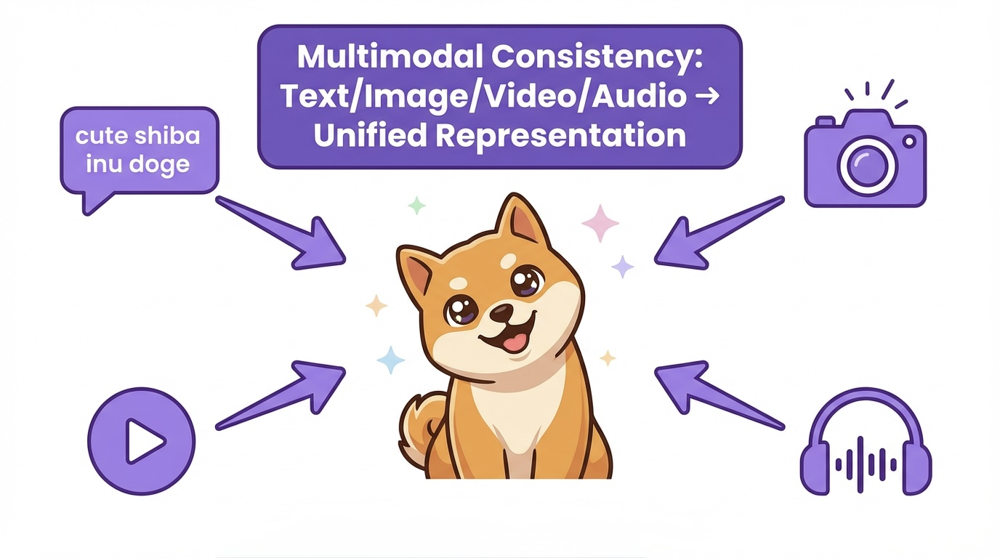
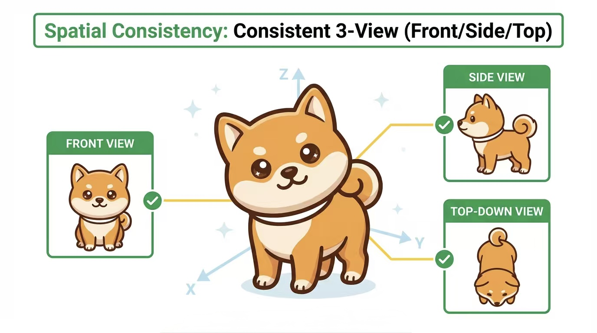
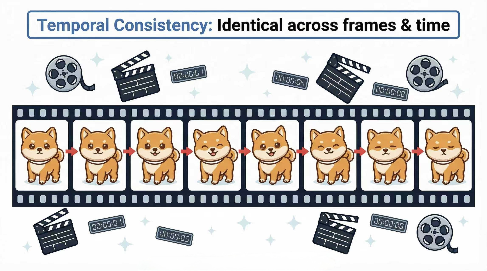

# Awesome World Model Evolution - Forging the World Model Universe from Unified Multimodal Models 

  
  
  
  
  

  <a href="README.md">English</a> | <a href="README_zh.md">中文</a>

  <strong>A curated collection of research papers, models, and resources tracing the evolution from specialized models to unified world models.</strong>

---

## 📋 Table of Contents

- [Awesome World Model Evolution - Forging the World Model Universe from Unified Multimodal Models](#awesome-world-model-evolution---forging-the-world-model-universe-from-unified-multimodal-models-)
  - [📋 Table of Contents](#-table-of-contents)
  - [🎯 Introduction](#-introduction)
    - [What is a World Model?](#what-is-a-world-model)
    - [The Three Fundamental Consistencies](#the-three-fundamental-consistencies)
      - [1️⃣ **Modality Consistency**](#1️⃣-modality-consistency)
      - [2️⃣ **Spatial Consistency**](#2️⃣-spatial-consistency)
      - [3️⃣ **Temporal Consistency**](#3️⃣-temporal-consistency)
    - [Why Unified Multimodal Models?](#why-unified-multimodal-models)
  - [🔬 Independent Exploration: Specialized Models](#-independent-exploration-specialized-models)
    - [Modality Consistency](#modality-consistency)
      - [Representative Works](#representative-works)
    - [Spatial Consistency](#spatial-consistency)
      - [Representative Works](#representative-works-1)
    - [Temporal Consistency](#temporal-consistency)
      - [Representative Works](#representative-works-2)
  - [🔗 Preliminary Integration: Unified Multimodal Models](#-preliminary-integration-unified-multimodal-models)
    - [Modality + Spatial Consistency](#modality--spatial-consistency)
      - [Representative Works](#representative-works-3)
    - [Modality + Temporal Consistency](#modality--temporal-consistency)
      - [Representative Works](#representative-works-4)
    - [Spatial + Temporal Consistency](#spatial--temporal-consistency)
      - [Representative Works](#representative-works-5)
  - [🌟 The "Trinity" Prototype: Emerging World Models](#-the-trinity-prototype-emerging-world-models)
    - [Text-to-World Generators](#text-to-world-generators)
      - [Representative Works](#representative-works-6)
    - [Embodied Intelligence Systems](#embodied-intelligence-systems)
      - [Representative Works](#representative-works-7)
  - [📊 Benchmarks and Evaluation](#-benchmarks-and-evaluation)
      - [Representative Works](#representative-works-8)
  - [📝 Contributing](#-contributing)
    - [How to Contribute](#how-to-contribute)
    - [Contribution Guidelines](#contribution-guidelines)
  - [⭐ Star History](#-star-history)
  - [📄 License](#-license)

---

## 🎯 Introduction

### What is a World Model?

A **World Model** is a computational system that learns the intrinsic laws governing our physical world and constructs an executable, dynamic simulation environment internally. Unlike conventional AI models that merely perform pattern matching or classification, a world model serves as an **internal simulator** capable of:

- 🔄 **Reproducing** observed events and phenomena
- 🎲 **Predicting** future states and outcomes
- 🤔 **Reasoning** about counterfactual scenarios (what-if analysis)
- 🎯 **Planning** long-term strategies based on simulated consequences

**Why World Models Matter:**

World models are considered a cornerstone toward achieving **Artificial General Intelligence (AGI)**:

- 🤖 **Embodied AI**: Robots can "rehearse" actions before execution
- 🚗 **Autonomous Systems**: Simulation of hazardous edge cases for safer deployment
- 🔬 **Scientific Discovery**: Accelerated understanding of complex systems through digital experimentation
- 🎮 **Interactive Environments**: Creation of controllable, physics-aware virtual worlds

### The Three Fundamental Consistencies

A fully functional world model must master three core competencies, which we term the **Three Fundamental Consistencies**:

#### 1️⃣ **Modality Consistency**

The "linguistic interface" between the model and reality.

- **Capability**: Bidirectional translation between high-dimensional sensory inputs (images, video, audio) and abstract symbolic representations (language, structured data)
- **Example Tasks**: Image captioning, text-to-image generation, visual question answering
- **Significance**: Enables the world model to receive instructions and communicate observations in human-interpretable formats

#### 2️⃣ **Spatial Consistency**

The "static 3D comprehension" of the physical world.

- **Capability**: Understanding that objects possess fixed geometric forms, occupy space, exhibit occlusion relationships, and maintain identity across viewpoints
- **Example Tasks**: Novel view synthesis, 3D reconstruction, multi-view consistency
- **Significance**: Forms the foundational "scene graph" enabling accurate spatial reasoning and navigation

#### 3️⃣ **Temporal Consistency**

The "physics engine" for dynamic simulation.

- **Capability**: Modeling how the world evolves over time, including object motion, physical interactions, and causal event chains
- **Example Tasks**: Video prediction, dynamics modeling, future state forecasting
- **Significance**: Enables anticipation of consequences and long-term planning capabilities

### Why Unified Multimodal Models?

This repository traces the evolution toward world models through **Unified Multimodal Models** (particularly Large Multimodal Models - LMMs), which we argue represent the most promising pathway forward:

**Key Advantages:**

- 🏗️ **Architectural Unity**: A central processing core (LLM backbone) with modular sensory interfaces naturally facilitates cross-modal integration
- ✨ **Emergent Understanding**: Pre-training on massive, diverse multimodal datasets enables implicit learning of world regularities rather than relying on manually engineered rules
- 📈 **Scalability**: Demonstrated scaling laws suggest capabilities improve predictably with increased parameters, data, and compute
- 🔄 **Synergistic Learning**: Different consistencies can emerge and reinforce each other through joint training

**Our Thesis:** End-to-end trained unified models are superior to task-specific specialized models for building world models, as they can learn the deep interconnections between modalities, space, and time.

---

## 🔬 Independent Exploration: Specialized Models

Before the era of unified models, researchers pursued a "divide-and-conquer" approach, developing specialized architectures for each consistency challenge. This foundational work established key techniques and insights that inform current unified approaches.

### <a href="./consisency-paper/modality-consistency/README.md">Modality Consistency</a>

**Objective**: Establish bidirectional mappings between symbolic (language) and perceptual (vision) representations.

**Historical Significance**: These models created the first "symbol-perception bridges," solving the fundamental I/O problem for world models.

#### Representative Works

<b>paper catalog</b>

* CLIP: Learning Transferable Visual Models From Natural Language Supervision, ICML 2021.
* DALL-E: Zero-Shot Text-to-Image Generation, ICML 2021.
* Show, Attend and Tell: Neural Image Caption Generation with Visual Attention, ICML 2015.
* AttnGAN: Fine-Grained Text-to-Image Generation with Attentional GANs, CVPR 2018.
*  Zero-Shot Text-to-Image Generation, arxiv (24 Feb 2021).
*  High-Resolution Image Synthesis with Latent Diffusion Models, arxiv (20 Dec 2021).
*  Photorealistic Text-to-Image Diffusion Models with Deep Language Understanding, arxiv (23 May 2022).
*  Scaling Autoregressive Models for Content-Rich Text-to-Image Generation, arxiv (22 Jun 2022).
*  Language Quantized AutoEncoders: Towards Unsupervised Text-Image Alignment, arxiv (2 Feb 2023).
*  IconShop: Text-Guided Vector Icon Synthesis with Autoregressive Transformers, arxiv (27 Apr 2023).
*  SDXL: Improving Latent Diffusion Models for High-Resolution Image Synthesis, arxiv (4 Jul 2023).
*  Emu: Generative Pretraining in Multimodality, arxiv (11 Jul 2023).
*  SDXL-Lightning: Progressive Adversarial Diffusion Distillation, arxiv (21 Feb 2024).
*  Beyond Text: Frozen Large Language Models in Visual Signal Comprehension, arxiv (12 Mar 2024).
*  Kandinsky 3.0 Technical Report, arxiv (6 Dec 2023).
*  PixArt-$伪$: Fast Training of Diffusion Transformer for Photorealistic Text-to-Image Synthesis, arxiv (30 Sep 2023).
*  EmoGen: Emotional Image Content Generation with Text-to-Image Diffusion Models, arxiv (9 Jan 2024).
*  Parrot: Pareto-optimal Multi-Reward Reinforcement Learning Framework for Text-to-Image Generation, arxiv (11 Jan 2024).
*  DiffusionGPT: LLM-Driven Text-to-Image Generation System, arxiv (18 Jan 2024).
*  MM-Interleaved: Interleaved Image-Text Generative Modeling via Multi-modal Feature Synchronizer, arxiv (18 Jan 2024).
*  Taiyi-Diffusion-XL: Advancing Bilingual Text-to-Image Generation with Large Vision-Language Model Support, arxiv (26 Jan 2024).
*  IntentTuner: An Interactive Framework for Integrating Human Intents in Fine-tuning Text-to-Image Generative Models, arxiv (28 Jan 2024).
*  Self-Play Fine-Tuning of Diffusion Models for Text-to-Image Generation, arxiv (15 Feb 2024).
*  Universal Prompt Optimizer for Safe Text-to-Image Generation, arxiv (16 Feb 2024).
*  Visual Concept-driven Image Generation with Text-to-Image Diffusion Model, arxiv (18 Feb 2024).
*  A User-Friendly Framework for Generating Model-Preferred Prompts in Text-to-Image Synthesis, arxiv (20 Feb 2024).
*  Scaling Rectified Flow Transformers for High-Resolution Image Synthesis, arxiv (5 Mar 2024).
*  PromptCharm: Text-to-Image Generation through Multi-modal Prompting and Refinement, arxiv (6 Mar 2024).
*  Discriminative Probing and Tuning for Text-to-Image Generation, arxiv (7 Mar 2024).
*  PixArt-危: Weak-to-Strong Training of Diffusion Transformer for 4K Text-to-Image Generation, arxiv (7 Mar 2024).
*  A 28.6 mJ/iter Stable Diffusion Processor for Text-to-Image Generation with Patch Similarity-based Sparsity Augmentation and Text-based Mixed-Precision, arxiv (8 Mar 2024).
*  CogView3: Finer and Faster Text-to-Image Generation via Relay Diffusion, arxiv (8 Mar 2024).
*  DivCon: Divide and Conquer for Complex Numerical and Spatial Reasoning in Text-to-Image Generation, arxiv (11 Mar 2024).
*  Block-wise LoRA: Revisiting Fine-grained LoRA for Effective Personalization and Stylization in Text-to-Image Generation, arxiv (12 Mar 2024).
*  Optimizing Negative Prompts for Enhanced Aesthetics and Fidelity in Text-To-Image Generation, arxiv (12 Mar 2024).
*  Bridging Different Language Models and Generative Vision Models for Text-to-Image Generation, arxiv (12 Mar 2024).
*  DialogGen: Multi-modal Interactive Dialogue System for Multi-turn Text-to-Image Generation, arxiv (13 Mar 2024).
*  CLIP-VQDiffusion : Langauge Free Training of Text To Image generation using CLIP and vector quantized diffusion model, arxiv (22 Mar 2024).
*  FlashEval: Towards Fast and Accurate Evaluation of Text-to-image Diffusion Generative Models, arxiv (25 Mar 2024).
*  Skews in the Phenomenon Space Hinder Generalization in Text-to-Image Generation, arxiv (25 Mar 2024).
*  Refining Text-to-Image Generation: Towards Accurate Training-Free Glyph-Enhanced Image Generation, arxiv (25 Mar 2024).
*  Isolated Diffusion: Optimizing Multi-Concept Text-to-Image Generation Training-Freely with Isolated Diffusion Guidance, arxiv (25 Mar 2024).
*  Be Yourself: Bounded Attention for Multi-Subject Text-to-Image Generation, arxiv (25 Mar 2024).
*  Capability-aware Prompt Reformulation Learning for Text-to-Image Generation, arxiv (27 Mar 2024).
*  Evaluating Text-to-Visual Generation with Image-to-Text Generation, arxiv (1 Apr 2024).
*  InstantStyle: Free Lunch towards Style-Preserving in Text-to-Image Generation, arxiv (3 Apr 2024).
*  MULAN: A Multi Layer Annotated Dataset for Controllable Text-to-Image Generation, arxiv (3 Apr 2024).
*  On the Scalability of Diffusion-based Text-to-Image Generation, arxiv (3 Apr 2024).
*  RL for Consistency Models: Faster Reward Guided Text-to-Image Generation, arxiv (25 Mar 2024).
*  Dynamic Prompt Optimizing for Text-to-Image Generation, arxiv (5 Apr 2024).
*  SafeGen: Mitigating Sexually Explicit Content Generation in Text-to-Image Models, arxiv (10 Apr 2024).
*  TextCenGen: Attention-Guided Text-Centric Background Adaptation for Text-to-Image Generation, arxiv (18 Apr 2024).
*  EdgeFusion: On-Device Text-to-Image Generation, arxiv (18 Apr 2024).
*  Object-Attribute Binding in Text-to-Image Generation: Evaluation and Control, arxiv (21 Apr 2024).
*  Towards Better Text-to-Image Generation Alignment via Attention Modulation, arxiv (22 Apr 2024).
*  Multimodal Large Language Model is a Human-Aligned Annotator for Text-to-Image Generation, arxiv (23 Apr 2024).
*  ID-Aligner: Enhancing Identity-Preserving Text-to-Image Generation with Reward Feedback Learning, arxiv (23 Apr 2024).
*  G-Refine: A General Quality Refiner for Text-to-Image Generation, arxiv (29 Apr 2024).
*  On Mechanistic Knowledge Localization in Text-to-Image Generative Models, arxiv (2 May 2024).
*  FlexEControl: Flexible and Efficient Multimodal Control for Text-to-Image Generation, arxiv (8 May 2024).
*  TriLoRA: Integrating SVD for Advanced Style Personalization in Text-to-Image Generation, arxiv (18 May 2024).
*  An Empirical Study and Analysis of Text-to-Image Generation Using Large Language Model-Powered Textual Representation, arxiv (21 May 2024).
*  Personalized Residuals for Concept-Driven Text-to-Image Generation, arxiv (21 May 2024).
*  Kaleido Diffusion: Improving Conditional Diffusion Models with Autoregressive Latent Modeling, arxiv (31 May 2024).
*  AttnDreamBooth: Towards Text-Aligned Personalized Text-to-Image Generation, arxiv (7 Jun 2024).
*  Ctrl-X: Controlling Structure and Appearance for Text-To-Image Generation Without Guidance, arxiv (11 Jun 2024).
*  Commonsense-T2I Challenge: Can Text-to-Image Generation Models Understand Commonsense?, arxiv (11 Jun 2024).
*  Improving Compositional Attribute Binding in Text-to-Image Generative Models via Enhanced Text Embeddings, arxiv (12 Jun 2024).
*  FairCoT: Enhancing Fairness in Text-to-Image Generation via Chain of Thought Reasoning with Multimodal Large Language Models, arxiv (13 Jun 2024).
*  STAR: Scale-wise Text-conditioned AutoRegressive image generation, arxiv (16 Jun 2024).
*  AITTI: Learning Adaptive Inclusive Token for Text-to-Image Generation, arxiv (18 Jun 2024).
*  Beyond Thumbs Up/Down: Untangling Challenges of Fine-Grained Feedback for Text-to-Image Generation, arxiv (24 Jun 2024).
*  MUMU: Bootstrapping Multimodal Image Generation from Text-to-Image Data, arxiv (26 Jun 2024).
*  AnyControl: Create Your Artwork with Versatile Control on Text-to-Image Generation, arxiv (27 Jun 2024).
*  PopAlign: Population-Level Alignment for Fair Text-to-Image Generation, arxiv (28 Jun 2024).
*  Prompt Refinement with Image Pivot for Text-to-Image Generation, arxiv (28 Jun 2024).
*  Efficient Personalized Text-to-image Generation by Leveraging Textual Subspace, arxiv (30 Jun 2024).
*  LLM4GEN: Leveraging Semantic Representation of LLMs for Text-to-Image Generation, arxiv (30 Jun 2024).
*  InstantStyle-Plus: Style Transfer with Content-Preserving in Text-to-Image Generation, arxiv (30 Jun 2024).
*  JeDi: Joint-Image Diffusion Models for Finetuning-Free Personalized Text-to-Image Generation, arxiv (8 Jul 2024).
*  Powerful and Flexible: Personalized Text-to-Image Generation via Reinforcement Learning, arxiv (9 Jul 2024).
*  MARS: Mixture of Auto-Regressive Models for Fine-grained Text-to-image Synthesis, arxiv (10 Jul 2024).
*  Addressing Image Hallucination in Text-to-Image Generation through Factual Image Retrieval, arxiv (15 Jul 2024).
*  Subject-driven Text-to-Image Generation via Preference-based Reinforcement Learning, arxiv (16 Jul 2024).
*  GreenStableYolo: Optimizing Inference Time and Image Quality of Text-to-Image Generation, arxiv (20 Jul 2024).
*  VersusDebias: Universal Zero-Shot Debiasing for Text-to-Image Models via SLM-Based Prompt Engineering and Generative Adversary, arxiv (28 Jul 2024).
*  Reproducibility Study of &#34;ITI-GEN: Inclusive Text-to-Image Generation&#34;, arxiv (29 Jul 2024).
*  VAR-CLIP: Text-to-Image Generator with Visual Auto-Regressive Modeling, arxiv (2 Aug 2024).
*  Lumina-mGPT: Illuminate Flexible Photorealistic Text-to-Image Generation with Multimodal Generative Pretraining, arxiv (5 Aug 2024).
*  FRAP: Faithful and Realistic Text-to-Image Generation with Adaptive Prompt Weighting, arxiv (21 Aug 2024).
*  Rethinking Training for De-biasing Text-to-Image Generation: Unlocking the Potential of Stable Diffusion, arxiv (22 Aug 2024).
*  Taming Text-to-Image Synthesis for Novices: User-centric Prompt Generation via Multi-turn Guidance, arxiv (23 Aug 2024).
*  Focus on Neighbors and Know the Whole: Towards Consistent Dense Multiview Text-to-Image Generator for 3D Creation, arxiv (23 Aug 2024).
*  CSGO: Content-Style Composition in Text-to-Image Generation, arxiv (29 Aug 2024).
*  Text-to-Image Generation Via Energy-Based CLIP, arxiv (30 Aug 2024).
*  SPDiffusion: Semantic Protection Diffusion Models for Multi-concept Text-to-image Generation, arxiv (2 Sep 2024).
*  Qihoo-T2X: An Efficient Proxy-Tokenized Diffusion Transformer for Text-to-Any-Task, arxiv (6 Sep 2024).
*  IFAdapter: Instance Feature Control for Grounded Text-to-Image Generation, arxiv (12 Sep 2024).
*  Generalizing Alignment Paradigm of Text-to-Image Generation with Preferences through $f$-divergence Minimization, arxiv (15 Sep 2024).
*  Evaluating Image Hallucination in Text-to-Image Generation with Question-Answering, arxiv (19 Sep 2024).
*  Text Image Generation for Low-Resource Languages with Dual Translation Learning, arxiv (26 Sep 2024).
*  MCGM: Mask Conditional Text-to-Image Generative Model, arxiv (1 Oct 2024).
*  Accelerating Auto-regressive Text-to-Image Generation with Training-free Speculative Jacobi Decoding, arxiv (2 Oct 2024).
*  ComfyGen: Prompt-Adaptive Workflows for Text-to-Image Generation, arxiv (2 Oct 2024).
*  A Spark of Vision-Language Intelligence: 2-Dimensional Autoregressive Transformer for Efficient Finegrained Image Generation, arxiv (2 Oct 2024).
*  EvolveDirector: Approaching Advanced Text-to-Image Generation with Large Vision-Language Models, arxiv (9 Oct 2024).
*  IterComp: Iterative Composition-Aware Feedback Learning from Model Gallery for Text-to-Image Generation, arxiv (9 Oct 2024).
*  Minority-Focused Text-to-Image Generation via Prompt Optimization, arxiv (10 Oct 2024).
*  DART: Denoising Autoregressive Transformer for Scalable Text-to-Image Generation, arxiv (10 Oct 2024).
*  Meissonic: Revitalizing Masked Generative Transformers for Efficient High-Resolution Text-to-Image Synthesis, arxiv (10 Oct 2024).
*  Text-To-Image with Generative Adversarial Networks, arxiv (11 Oct 2024).
*  Generating Intermediate Representations for Compositional Text-To-Image Generation, arxiv (13 Oct 2024).
*  FlexGen: Flexible Multi-View Generation from Text and Image Inputs, arxiv (14 Oct 2024).
*  HART: Efficient Visual Generation with Hybrid Autoregressive Transformer, arxiv (14 Oct 2024).
*  SAFREE: Training-Free and Adaptive Guard for Safe Text-to-Image And Video Generation, arxiv (16 Oct 2024).
*  Fluid: Scaling Autoregressive Text-to-image Generative Models with Continuous Tokens, arxiv (17 Oct 2024).
*  Synergistic Dual Spatial-aware Generation of Image-to-Text and Text-to-Image, arxiv (20 Oct 2024).
*  Progressive Compositionality in Text-to-Image Generative Models, arxiv (22 Oct 2024).
*  FairQueue: Rethinking Prompt Learning for Fair Text-to-Image Generation, arxiv (24 Oct 2024).
*  Diff-Instruct++: Training One-step Text-to-image Generator Model to Align with Human Preferences, arxiv (24 Oct 2024).
*  Kandinsky 3: Text-to-Image Synthesis for Multifunctional Generative Framework, arxiv (28 Oct 2024).
*  Diffusion Beats Autoregressive: An Evaluation of Compositional Generation in Text-to-Image Models, arxiv (30 Oct 2024).
*  Image2Text2Image: A Novel Framework for Label-Free Evaluation of Image-to-Text Generation with Text-to-Image Diffusion Models, arxiv (8 Nov 2024).
*  Region-Aware Text-to-Image Generation via Hard Binding and Soft Refinement, arxiv (10 Nov 2024).
*  JanusFlow: Harmonizing Autoregression and Rectified Flow for Unified Multimodal Understanding and Generation, arxiv (12 Nov 2024).
*  Visual question answering based evaluation metrics for text-to-image generation, arxiv (15 Nov 2024).
*  Safe Text-to-Image Generation: Simply Sanitize the Prompt Embedding, arxiv (15 Nov 2024).
*  High-Resolution Image Synthesis via Next-Token Prediction, arxiv (22 Nov 2024).
*  Automatic Evaluation for Text-to-image Generation: Task-decomposed Framework, Distilled Training, and Meta-evaluation Benchmark, arxiv (23 Nov 2024).
*  Interactive Visual Assessment for Text-to-Image Generation Models, arxiv (23 Nov 2024).
*  ChatGen: Automatic Text-to-Image Generation From FreeStyle Chatting, arxiv (26 Nov 2024).
*  Interleaved Scene Graphs for Interleaved Text-and-Image Generation Assessment, arxiv (26 Nov 2024).
*  Reward Incremental Learning in Text-to-Image Generation, arxiv (26 Nov 2024).
*  Type-R: Automatically Retouching Typos for Text-to-Image Generation, arxiv (27 Nov 2024).
*  Enhancing MMDiT-Based Text-to-Image Models for Similar Subject Generation, arxiv (27 Nov 2024).
*  All Seeds Are Not Equal: Enhancing Compositional Text-to-Image Generation with Reliable Random Seeds, arxiv (27 Nov 2024).
*  Switti: Designing Scale-Wise Transformers for Text-to-Image Synthesis, arxiv (2 Dec 2024).
*  Cross-Attention Head Position Patterns Can Align with Human Visual Concepts in Text-to-Image Generative Models, arxiv (3 Dec 2024).
*  DynamicControl: Adaptive Condition Selection for Improved Text-to-Image Generation, arxiv (4 Dec 2024).
*  Safeguarding Text-to-Image Generation via Inference-Time Prompt-Noise Optimization, arxiv (5 Dec 2024).
*  Infinity: Scaling Bitwise AutoRegressive Modeling for High-Resolution Image Synthesis, arxiv (5 Dec 2024).
*  LayerFusion: Harmonized Multi-Layer Text-to-Image Generation with Generative Priors, arxiv (5 Dec 2024).
*  Proactive Agents for Multi-Turn Text-to-Image Generation Under Uncertainty, arxiv (9 Dec 2024).
*  Boosting Alignment for Post-Unlearning Text-to-Image Generative Models, arxiv (9 Dec 2024).
*  Fast Prompt Alignment for Text-to-Image Generation, arxiv (11 Dec 2024).
*  Preference Adaptive and Sequential Text-to-Image Generation, arxiv (10 Dec 2024).
*  AlignGuard: Scalable Safety Alignment for Text-to-Image Generation, arxiv (13 Dec 2024).
*  Efficient Scaling of Diffusion Transformers for Text-to-Image Generation, arxiv (16 Dec 2024).
*  ArtAug: Enhancing Text-to-Image Generation through Synthesis-Understanding Interaction, arxiv (17 Dec 2024).
*  GALOT: Generative Active Learning via Optimizable Zero-shot Text-to-image Generation, arxiv (18 Dec 2024).
*  Self-Corrected Flow Distillation for Consistent One-Step and Few-Step Text-to-Image Generation, arxiv (22 Dec 2024).
*  Hierarchical Vision-Language Alignment for Text-to-Image Generation via Diffusion Models, arxiv (1 Jan 2025).
*  Evaluating Image Caption via Cycle-consistent Text-to-Image Generation, arxiv (7 Jan 2025).
*  Boosting Text-To-Image Generation via Multilingual Prompting in Large Multimodal Models, arxiv (13 Jan 2025).
*  Democratizing Text-to-Image Masked Generative Models with Compact Text-Aware One-Dimensional Tokens, arxiv (13 Jan 2025).
*  SHYI: Action Support for Contrastive Learning in High-Fidelity Text-to-Image Generation, arxiv (15 Jan 2025).
*  IMAGINE-E: Image Generation Intelligence Evaluation of State-of-the-art Text-to-Image Models, arxiv (23 Jan 2025).
*  Text-to-Image Generation for Vocabulary Learning Using the Keyword Method, arxiv (28 Jan 2025).
*  TextAtlas5M: A Large-scale Dataset for Dense Text Image Generation, arxiv (11 Feb 2025).
*  Skrr: Skip and Re-use Text Encoder Layers for Memory Efficient Text-to-Image Generation, arxiv (12 Feb 2025).
*  FlexControl: Computation-Aware ControlNet with Differentiable Router for Text-to-Image Generation, arxiv (11 Feb 2025).
*  REAL: Realism Evaluation of Text-to-Image Generation Models for Effective Data Augmentation, arxiv (15 Feb 2025).
*  Learning to Sample Effective and Diverse Prompts for Text-to-Image Generation, arxiv (17 Feb 2025).
*  CHATS: Combining Human-Aligned Optimization and Test-Time Sampling for Text-to-Image Generation, arxiv (18 Feb 2025).
*  FlipConcept: Tuning-Free Multi-Concept Personalization for Text-to-Image Generation, arxiv (21 Feb 2025).
*  Multi-Agent Multimodal Models for Multicultural Text to Image Generation, arxiv (21 Feb 2025).
*  Multimodal Representation Alignment for Image Generation: Text-Image Interleaved Control Is Easier Than You Think, arxiv (27 Feb 2025).
*  Fine-Grained Alignment and Noise Refinement for Compositional Text-to-Image Generation, arxiv (9 Mar 2025).
*  Unleashing the Potential of Large Language Models for Text-to-Image Generation through Autoregressive Representation Alignment, arxiv (10 Mar 2025).
*  SANA-Sprint: One-Step Diffusion with Continuous-Time Consistency Distillation, arxiv (12 Mar 2025).
*  ConceptGuard: Continual Personalized Text-to-Image Generation with Forgetting and Confusion Mitigation, arxiv (13 Mar 2025).
*  DiT-Air: Revisiting the Efficiency of Diffusion Model Architecture Design in Text to Image Generation, arxiv (13 Mar 2025).
*  TF-TI2I: Training-Free Text-and-Image-to-Image Generation via Multi-Modal Implicit-Context Learning in Text-to-Image Models, arxiv (19 Mar 2025).
*  Zero-Shot Styled Text Image Generation, but Make It Autoregressive, arxiv (21 Mar 2025).
*  Progressive Prompt Detailing for Improved Alignment in Text-to-Image Generative Models, arxiv (22 Mar 2025).
*  Plug-and-Play Interpretable Responsible Text-to-Image Generation via Dual-Space Multi-facet Concept Control, arxiv (24 Mar 2025).
*  Beyond Words: Advancing Long-Text Image Generation via Multimodal Autoregressive Models, arxiv (26 Mar 2025).
*  Lumina-Image 2.0: A Unified and Efficient Image Generative Framework, arxiv (27 Mar 2025).
*  Geometrical Properties of Text Token Embeddings for Strong Semantic Binding in Text-to-Image Generation, arxiv (29 Mar 2025).
*  LayerCraft: Enhancing Text-to-Image Generation with CoT Reasoning and Layered Object Integration, arxiv (25 Mar 2025).
*  Compass Control: Multi Object Orientation Control for Text-to-Image Generation, arxiv (9 Apr 2025).
*  Towards NSFW-Free Text-to-Image Generation via Safety-Constraint Direct Preference Optimization, arxiv (19 Apr 2025).
*  LLM-Enabled Style and Content Regularization for Personalized Text-to-Image Generation, arxiv (19 Apr 2025).
*  RefVNLI: Towards Scalable Evaluation of Subject-driven Text-to-image Generation, arxiv (24 Apr 2025).
*  TextTIGER: Text-based Intelligent Generation with Entity Prompt Refinement for Text-to-Image Generation, arxiv (25 Apr 2025).
*  T2I-R1: Reinforcing Image Generation with Collaborative Semantic-level and Token-level CoT, arxiv (1 May 2025).
*  Deconstructing Bias: A Multifaceted Framework for Diagnosing Cultural and Compositional Inequities in Text-to-Image Generative Models, arxiv (5 Apr 2025).
*  Improving Physical Object State Representation in Text-to-Image Generative Systems, arxiv (4 May 2025).
*  MCCD: Multi-Agent Collaboration-based Compositional Diffusion for Complex Text-to-Image Generation, arxiv (5 May 2025).
*  HCMA: Hierarchical Cross-model Alignment for Grounded Text-to-Image Generation, arxiv (10 May 2025).
*  IMAGE-ALCHEMY: Advancing subject fidelity in personalised text-to-image generation, arxiv (15 May 2025).
*  CompAlign: Improving Compositional Text-to-Image Generation with a Complex Benchmark and Fine-Grained Feedback, arxiv (16 May 2025).
*  Diff-MM: Exploring Pre-trained Text-to-Image Generation Model for Unified Multi-modal Object Tracking, arxiv (19 May 2025).
*  Emerging Properties in Unified Multimodal Pretraining, arxiv (20 May 2025).
*  Harnessing Caption Detailness for Data-Efficient Text-to-Image Generation, arxiv (21 May 2025).
*  IA-T2I: Internet-Augmented Text-to-Image Generation, arxiv (21 May 2025).
*  Self-Rewarding Large Vision-Language Models for Optimizing Prompts in Text-to-Image Generation, arxiv (22 May 2025).
*  RePrompt: Reasoning-Augmented Reprompting for Text-to-Image Generation via Reinforcement Learning, arxiv (23 May 2025).
*  Align Beyond Prompts: Evaluating World Knowledge Alignment in Text-to-Image Generation, arxiv (24 May 2025).
*  Training-free Stylized Text-to-Image Generation with Fast Inference, arxiv (25 May 2025).
*  Alchemist: Turning Public Text-to-Image Data into Generative Gold, arxiv (25 May 2025).
*  StyleAR: Customizing Multimodal Autoregressive Model for Style-Aligned Text-to-Image Generation, arxiv (26 May 2025).
*  Identity-Preserving Text-to-Image Generation via Dual-Level Feature Decoupling and Expert-Guided Fusion, arxiv (28 May 2025).
*  HiDream-I1: A High-Efficient Image Generative Foundation Model with Sparse Diffusion Transformer, arxiv (28 May 2025).
*  Rhetorical Text-to-Image Generation via Two-layer Diffusion Policy Optimization, arxiv (28 May 2025).
*  Muddit: Liberating Generation Beyond Text-to-Image with a Unified Discrete Diffusion Model, arxiv (29 May 2025).
*  OSPO: Object-centric Self-improving Preference Optimization for Text-to-Image Generation, arxiv (28 May 2025).
*  DIMCIM: A Quantitative Evaluation Framework for Default-mode Diversity and Generalization in Text-to-Image Generative Models, arxiv (5 Jun 2025).
*  FocusDiff: Advancing Fine-Grained Text-Image Alignment for Autoregressive Visual Generation through RL, arxiv (5 Jun 2025).
*  A Comprehensive Study of Decoder-Only LLMs for Text-to-Image Generation, arxiv (9 Jun 2025).
*  A High-Quality Dataset and Reliable Evaluation for Interleaved Image-Text Generation, arxiv (11 Jun 2025).
*  ELBO-T2IAlign: A Generic ELBO-Based Method for Calibrating Pixel-level Text-Image Alignment in Diffusion Models, arxiv (11 Jun 2025).
*  Fair Generation without Unfair Distortions: Debiasing Text-to-Image Generation with Entanglement-Free Attention, arxiv (16 Jun 2025).
*  Discrete JEPA: Learning Discrete Token Representations without Reconstruction, arxiv (17 Jun 2025).
*  Cost-Aware Routing for Efficient Text-To-Image Generation, arxiv (17 Jun 2025).
*  NSFW-Classifier Guided Prompt Sanitization for Safe Text-to-Image Generation, arxiv (23 Jun 2025).
*  Ovis-U1 Technical Report, arxiv (29 Jun 2025).
*  RichControl: Structure- and Appearance-Rich Training-Free Spatial Control for Text-to-Image Generation, arxiv (3 Jul 2025).
*  Subject-Consistent and Pose-Diverse Text-to-Image Generation, arxiv (11 Jul 2025).
*  Visual Semantic Description Generation with MLLMs for Image-Text Matching, arxiv (11 Jul 2025).
*  RaDL: Relation-aware Disentangled Learning for Multi-Instance Text-to-Image Generation, arxiv (16 Jul 2025).
*  ID-EA: Identity-driven Text Enhancement and Adaptation with Textual Inversion for Personalized Text-to-Image Generation, arxiv (16 Jul 2025).
*  Local Representative Token Guided Merging for Text-to-Image Generation, arxiv (17 Jul 2025).
*  LSSGen: Leveraging Latent Space Scaling in Flow and Diffusion for Efficient Text to Image Generation, arxiv (22 Jul 2025).
*  Lumina-mGPT 2.0: Stand-Alone AutoRegressive Image Modeling, arxiv (23 Jul 2025).
*  T2I-Copilot: A Training-Free Multi-Agent Text-to-Image System for Enhanced Prompt Interpretation and Interactive Generation, arxiv (28 Jul 2025).
*  Multimodal LLMs as Customized Reward Models for Text-to-Image Generation, arxiv (28 Jul 2025).
*  Qwen-Image Technical Report, arxiv (4 Aug 2025).
*  Documenting Patterns of Exoticism of Marginalized Populations within Text-to-Image Generators, arxiv (4 Aug 2025).
*  Draw Your Mind: Personalized Generation via Condition-Level Modeling in Text-to-Image Diffusion Models, arxiv (5 Aug 2025).
*  LumiGen: An LVLM-Enhanced Iterative Framework for Fine-Grained Text-to-Image Generation, arxiv (5 Aug 2025).
*  UNCAGE: Contrastive Attention Guidance for Masked Generative Transformers in Text-to-Image Generation, arxiv (7 Aug 2025).
*  CoAR: Concept Injection into Autoregressive Models for Personalized Text-to-Image Generation, arxiv (10 Aug 2025).
*  Dual Recursive Feedback on Generation and Appearance Latents for Pose-Robust Text-to-Image Diffusion, arxiv (13 Aug 2025).
*  High Fidelity Text to Image Generation with Contrastive Alignment and Structural Guidance, arxiv (14 Aug 2025).
*  CEIDM: A Controlled Entity and Interaction Diffusion Model for Enhanced Text-to-Image Generation, arxiv (25 Aug 2025).
*  HADIS: Hybrid Adaptive Diffusion Model Serving for Efficient Text-to-Image Generation, arxiv (31 Aug 2025).
*  Data-Driven Loss Functions for Inference-Time Optimization in Text-to-Image Generation, arxiv (2 Sep 2025).
*  PromptEnhancer: A Simple Approach to Enhance Text-to-Image Models via Chain-of-Thought Prompt Rewriting, arxiv (4 Sep 2025).
*  EditIDv2: Editable ID Customization with Data-Lubricated ID Feature Integration for Text-to-Image Generation, arxiv (6 Sep 2025).
*  BiasMap: Leveraging Cross-Attentions to Discover and Mitigate Hidden Social Biases in Text-to-Image Generation, arxiv (16 Sep 2025).
*  DEFT: Decompositional Efficient Fine-Tuning for Text-to-Image Models, arxiv (26 Sep 2025).
*  No Concept Left Behind: Test-Time Optimization for Compositional Text-to-Image Generation, arxiv (27 Sep 2025).
*  Free Lunch Alignment of Text-to-Image Diffusion Models without Preference Image Pairs, arxiv (30 Sep 2025).
*  VQGAN-CLIP: Open Domain Image Generation and Editing with Natural Language Guidance, arxiv (18 Apr 2022).
*  InstructPix2Pix: Learning to Follow Image Editing Instructions, arxiv (17 Nov 2022).
*  MagicBrush: A Manually Annotated Dataset for Instruction-Guided Image Editing, arxiv (16 Jun 2023).
*  An Item is Worth a Prompt: Versatile Image Editing with Disentangled Control, arxiv (7 Mar 2024).
*  InstructGIE: Towards Generalizable Image Editing, arxiv (8 Mar 2024).
*  Leveraging LLMs for On-the-Fly Instruction Guided Image Editing, arxiv (12 Mar 2024).
*  Enhancing Text-to-Image Editing via Hybrid Mask-Informed Fusion, arxiv (24 May 2024).
*  Text Guided Image Editing with Automatic Concept Locating and Forgetting, arxiv (30 May 2024).
*  Empowering Visual Creativity: A Vision-Language Assistant to Image Editing Recommendations, arxiv (31 May 2024).
*  The Curious Case of End Token: A Zero-Shot Disentangled Image Editing using CLIP, arxiv (1 Jun 2024).
*  UltraEdit: Instruction-based Fine-Grained Image Editing at Scale, arxiv (7 Jul 2024).
*  EditScribe: Non-Visual Image Editing with Natural Language Verification Loops, arxiv (13 Aug 2024).
*  FastEdit: Fast Text-Guided Single-Image Editing via Semantic-Aware Diffusion Fine-Tuning, arxiv (6 Aug 2024).
*  TurboEdit: Instant text-based image editing, arxiv (14 Aug 2024).
*  ReEdit: Multimodal Exemplar-Based Image Editing with Diffusion Models, arxiv (6 Nov 2024).
*  Multi-Reward as Condition for Instruction-based Image Editing, arxiv (6 Nov 2024).
*  OmniEdit: Building Image Editing Generalist Models Through Specialist Supervision, arxiv (11 Nov 2024).
*  AnyEdit: Mastering Unified High-Quality Image Editing for Any Idea, arxiv (24 Nov 2024).
*  TPIE: Topology-Preserved Image Editing With Text Instructions, arxiv (22 Nov 2024).
*  InsightEdit: Towards Better Instruction Following for Image Editing, arxiv (26 Nov 2024).
*  UIP2P: Unsupervised Instruction-based Image Editing via Edit Reversibility Constraint, arxiv (19 Dec 2024).
*  Textualize Visual Prompt for Image Editing via Diffusion Bridge, arxiv (7 Jan 2025).
*  Hands-off Image Editing: Language-guided Editing without any Task-specific Labeling, Masking or even Training, arxiv (14 Feb 2025).
*  PromptArtisan: Multi-instruction Image Editing in Single Pass with Complete Attention Control, arxiv (14 Feb 2025).
*  Instruct-CLIP: Improving Instruction-Guided Image Editing with Automated Data Refinement Using Contrastive Learning, arxiv (24 Mar 2025).
*  Tuning-Free Image Editing with Fidelity and Editability via Unified Latent Diffusion Model, arxiv (8 Apr 2025).
*  Omni$^2$: Unifying Omnidirectional Image Generation and Editing in an Omni Model, arxiv (15 Apr 2025).
*  X-Edit: Detecting and Localizing Edits in Images Altered by Text-Guided Diffusion Models, arxiv (16 May 2025).
*  Step1X-Edit: A Practical Framework for General Image Editing, arxiv (24 Apr 2025).
*  FLUX.1 Kontext: Flow Matching for In-Context Image Generation and Editing in Latent Space, arxiv (17 Jun 2025).
*  Towards Efficient Exemplar Based Image Editing with Multimodal VLMs, arxiv (25 Jun 2025).
*  Reasoning to Edit: Hypothetical Instruction-Based Image Editing with Visual Reasoning, arxiv (2 Jul 2025).
*  Beyond Simple Edits: X-Planner for Complex Instruction-Based Image Editing, arxiv (7 Jul 2025).
*  NoHumansRequired: Autonomous High-Quality Image Editing Triplet Mining, arxiv (18 Jul 2025).
*  Qwen-Image Technical Report, arxiv (4 Aug 2025).
*  Talk2Image: A Multi-Agent System for Multi-Turn Image Generation and Editing, arxiv (9 Aug 2025).
*  CannyEdit: Selective Canny Control and Dual-Prompt Guidance for Training-Free Image Editing, arxiv (9 Aug 2025).
*  Exploring Multimodal Diffusion Transformers for Enhanced Prompt-based Image Editing, arxiv (11 Aug 2025).
*  X2Edit: Revisiting Arbitrary-Instruction Image Editing through Self-Constructed Data and Task-Aware Representation Learning, arxiv (11 Aug 2025).
*  An LLM-LVLM Driven Agent for Iterative and Fine-Grained Image Editing, arxiv (24 Aug 2025).
*  Describe, Don&#39;t Dictate: Semantic Image Editing with Natural Language Intent, arxiv (28 Aug 2025).
*  Draw-In-Mind: Rebalancing Designer-Painter Roles in Unified Multimodal Models Benefits Image Editing, arxiv (2 Sep 2025).
*  MultiEdit: Advancing Instruction-based Image Editing on Diverse and Challenging Tasks, arxiv (18 Sep 2025).
*  AutoEdit: Automatic Hyperparameter Tuning for Image Editing, arxiv (18 Sep 2025).
*  CAMILA: Context-Aware Masking for Image Editing with Language Alignment, arxiv (24 Sep 2025).
*  EditVerse: Unifying Image and Video Editing and Generation with In-Context Learning, arxiv (24 Sep 2025).
*  EditScore: Unlocking Online RL for Image Editing via High-Fidelity Reward Modeling, arxiv (28 Sep 2025).
*  EditReward: A Human-Aligned Reward Model for Instruction-Guided Image Editing, arxiv (30 Sep 2025).
*  Query-Kontext: An Unified Multimodal Model for Image Generation and Editing, arxiv (30 Sep 2025).
*  GODIVA: Generating Open-DomaIn Videos from nAtural Descriptions, arxiv (30 Apr 2021).
*  N脺WA: Visual Synthesis Pre-training for Neural visUal World creAtion, arxiv (24 Nov 2021).
*  VideoGen: A Reference-Guided Latent Diffusion Approach for High Definition Text-to-Video Generation, arxiv (1 Sep 2023).
*  Hierarchical Spatio-temporal Decoupling for Text-to-Video Generation, arxiv (7 Dec 2023).
*  UniCtrl: Improving the Spatiotemporal Consistency of Text-to-Video Diffusion Models via Training-Free Unified Attention Control, arxiv (4 Mar 2024).
*  ViD-GPT: Introducing GPT-style Autoregressive Generation in Video Diffusion Models, arxiv (16 Jun 2024).
*  TALC: Time-Aligned Captions for Multi-Scene Text-to-Video Generation, arxiv (7 May 2024).
*  DisenStudio: Customized Multi-subject Text-to-Video Generation with Disentangled Spatial Control, arxiv (21 May 2024).
*  MotionBooth: Motion-Aware Customized Text-to-Video Generation, arxiv (25 Jun 2024).
*  Text-Animator: Controllable Visual Text Video Generation, arxiv (25 Jun 2024).
*  CogVideoX: Text-to-Video Diffusion Models with An Expert Transformer, arxiv (12 Aug 2024).
*  Qihoo-T2X: An Efficient Proxy-Tokenized Diffusion Transformer for Text-to-Any-Task, arxiv (6 Sep 2024).
*  Loong: Generating Minute-level Long Videos with Autoregressive Language Models, arxiv (3 Oct 2024).
*  DiCoDe: Diffusion-Compressed Deep Tokens for Autoregressive Video Generation with Language Models, arxiv (5 Dec 2024).
*  InstanceCap: Improving Text-to-Video Generation via Instance-aware Structured Caption, arxiv (12 Dec 2024).
*  TIV-Diffusion: Towards Object-Centric Movement for Text-driven Image to Video Generation, arxiv (13 Dec 2024).
*  LTX-Video: Realtime Video Latent Diffusion, arxiv (30 Dec 2024).
*  Step-Video-T2V Technical Report: The Practice, Challenges, and Future of Video Foundation Model, arxiv (14 Feb 2025).
*  Wan: Open and Advanced Large-Scale Video Generative Models, arxiv (26 Mar 2025).
*  VPO: Aligning Text-to-Video Generation Models with Prompt Optimization, arxiv (26 Mar 2025).
*  DyST-XL: Dynamic Layout Planning and Content Control for Compositional Text-to-Video Generation, arxiv (21 Apr 2025).
*  ShotAdapter: Text-to-Multi-Shot Video Generation with Diffusion Models, arxiv (12 May 2025).
*  MOVi: Training-free Text-conditioned Multi-Object Video Generation, arxiv (29 May 2025).
*  Self Forcing: Bridging the Train-Test Gap in Autoregressive Video Diffusion, arxiv (9 Jun 2025).
*  Lumos-1: On Autoregressive Video Generation from a Unified Model Perspective, arxiv (11 Jul 2025).
*  TITAN-Guide: Taming Inference-Time AligNment for Guided Text-to-Video Diffusion Models, arxiv (1 Aug 2025).
*  VidCLearn: A Continual Learning Approach for Text-to-Video Generation, arxiv (21 Sep 2025).
*  Wan-Alpha: High-Quality Text-to-Video Generation with Alpha Channel, arxiv (29 Sep 2025).
*  TempoControl: Temporal Attention Guidance for Text-to-Video Models, arxiv (2 Oct 2025).
*  CamViG: Camera Aware Image-to-Video Generation with Multimodal Transformers, arxiv (21 May 2024).
*  CamCo: Camera-Controllable 3D-Consistent Image-to-Video Generation, arxiv (4 Jun 2024).
*  JVID: Joint Video-Image Diffusion for Visual-Quality and Temporal-Consistency in Video Generation, arxiv (21 Sep 2024).
*  FrameBridge: Improving Image-to-Video Generation with Bridge Models, arxiv (20 Oct 2024).
*  TIP-I2V: A Million-Scale Real Text and Image Prompt Dataset for Image-to-Video Generation, arxiv (5 Nov 2024).
*  SG-I2V: Self-Guided Trajectory Control in Image-to-Video Generation, arxiv (7 Nov 2024).
*  OmniDrag: Enabling Motion Control for Omnidirectional Image-to-Video Generation, arxiv (12 Dec 2024).
*  TIV-Diffusion: Towards Object-Centric Movement for Text-driven Image to Video Generation, arxiv (13 Dec 2024).
*  Through-The-Mask: Mask-based Motion Trajectories for Image-to-Video Generation, arxiv (6 Jan 2025).
*  VidCRAFT3: Camera, Object, and Lighting Control for Image-to-Video Generation, arxiv (11 Feb 2025).
*  RealCam-I2V: Real-World Image-to-Video Generation with Interactive Complex Camera Control, arxiv (14 Feb 2025).
*  TextOCVP: Object-Centric Video Prediction with Language Guidance, arxiv (17 Feb 2025).
*  Dynamic-I2V: Exploring Image-to-Video Generation Models via Multimodal LLM, arxiv (26 May 2025).
*  MotionPro: A Precise Motion Controller for Image-to-Video Generation, arxiv (26 May 2025).
*  Consistent Video Editing as Flow-Driven Image-to-Video Generation, arxiv (9 Jun 2025).
*  Versatile Transition Generation with Image-to-Video Diffusion, arxiv (3 Aug 2025).
*  Zero-shot 3D-Aware Trajectory-Guided image-to-video generation via Test-Time Training, arxiv (8 Sep 2025).
*  Vid-Freeze: Protecting Images from Malicious Image-to-Video Generation via Temporal Freezing, arxiv (27 Sep 2025).
*  MotionRAG: Motion Retrieval-Augmented Image-to-Video Generation, arxiv (30 Sep 2025).
*  Moonshot: Towards Controllable Video Generation and Editing with Multimodal Conditions, arxiv (3 Jan 2024).
*  LAVE: LLM-Powered Agent Assistance and Language Augmentation for Video Editing, arxiv (15 Feb 2024).
*  ExpressEdit: Video Editing with Natural Language and Sketching, arxiv (26 Mar 2024).
*  GenVideo: One-shot Target-image and Shape Aware Video Editing using T2I Diffusion Models, arxiv (18 Apr 2024).
*  Edit-Your-Motion: Space-Time Diffusion Decoupling Learning for Video Motion Editing, arxiv (7 May 2024).
*  Learning Action and Reasoning-Centric Image Editing from Videos and Simulations, arxiv (3 Jul 2024).
*  A Reinforcement Learning-Based Automatic Video Editing Method Using Pre-trained Vision-Language Model, arxiv (7 Nov 2024).
*  VideoDirector: Precise Video Editing via Text-to-Video Models, arxiv (26 Nov 2024).
*  SPAgent: Adaptive Task Decomposition and Model Selection for General Video Generation and Editing, arxiv (28 Nov 2024).
*  DIVE: Taming DINO for Subject-Driven Video Editing, arxiv (4 Dec 2024).
*  Re-Attentional Controllable Video Diffusion Editing, arxiv (16 Dec 2024).
*  Edit as You See: Image-guided Video Editing via Masked Motion Modeling, arxiv (8 Jan 2025).
*  VideoPainter: Any-length Video Inpainting and Editing with Plug-and-Play Context Control, arxiv (7 Mar 2025).
*  VACE: All-in-One Video Creation and Editing, arxiv (10 Mar 2025).
*  VEGGIE: Instructional Editing and Reasoning Video Concepts with Grounded Generation, arxiv (18 Mar 2025).
*  InstructVEdit: A Holistic Approach for Instructional Video Editing, arxiv (22 Mar 2025).
*  OmniV2V: Versatile Video Generation and Editing via Dynamic Content Manipulation, arxiv (2 Jun 2025).
*  Yan: Foundational Interactive Video Generation, arxiv (12 Aug 2025).
*  EditDuet: A Multi-Agent System for Video Non-Linear Editing, arxiv (13 Sep 2025).
*  Prompt-Driven Agentic Video Editing System: Autonomous Comprehension of Long-Form, Story-Driven Media, arxiv (20 Sep 2025).
*  EditVerse: Unifying Image and Video Editing and Generation with In-Context Learning, arxiv (24 Sep 2025).
*  ERNIE-ViLG: Unified Generative Pre-training for Bidirectional Vision-Language Generation, arxiv (31 Dec 2021).
*  Unified-IO: A Unified Model for Vision, Language, and Multi-Modal Tasks, arxiv (17 Jun 2022).
*  Grounding Language Models to Images for Multimodal Inputs and Outputs, arxiv (31 Jan 2023).
*  Any-to-Any Generation via Composable Diffusion, arxiv (19 May 2023).
*  Planting a SEED of Vision in Large Language Model, arxiv (16 Jul 2023).
*  Unified Language-Vision Pretraining in LLM with Dynamic Discrete Visual Tokenization, arxiv (9 Sep 2023).
*  VL-GPT: A Generative Pre-trained Transformer for Vision and Language Understanding and Generation, arxiv (14 Dec 2023).
*  Unifying Generation and Compression: Ultra-low bitrate Image Coding Via Multi-stage Transformer, arxiv (6 Mar 2024).
*  In-Context Translation: Towards Unifying Image Recognition, Processing, and Generation, arxiv (15 Apr 2024).
*  SEED-X: Multimodal Models with Unified Multi-granularity Comprehension and Generation, arxiv (22 Apr 2024).
*  Chameleon: Mixed-Modal Early-Fusion Foundation Models, arxiv (16 May 2024).
*  Libra: Building Decoupled Vision System on Large Language Models, arxiv (16 May 2024).
*  GenArtist: Multimodal LLM as an Agent for Unified Image Generation and Editing, arxiv (8 Jul 2024).
*  ANOLE: An Open, Autoregressive, Native Large Multimodal Models for Interleaved Image-Text Generation, arxiv (8 Jul 2024).
*  Show-o: One Single Transformer to Unify Multimodal Understanding and Generation, arxiv (22 Aug 2024).
*  PUMA: Empowering Unified MLLM with Multi-granular Visual Generation, arxiv (17 Oct 2024).
*  VILA-U: a Unified Foundation Model Integrating Visual Understanding and Generation, arxiv (6 Sep 2024).
*  UniMuMo: Unified Text, Music and Motion Generation, arxiv (6 Oct 2024).
*  Janus: Decoupling Visual Encoding for Unified Multimodal Understanding and Generation, arxiv (17 Oct 2024).
*  Orthus: Autoregressive Interleaved Image-Text Generation with Modality-Specific Heads, arxiv (28 Nov 2024).
*  MUSE-VL: Modeling Unified VLM through Semantic Discrete Encoding, arxiv (26 Nov 2024).
*  Liquid: Language Models are Scalable and Unified Multi-modal Generators, arxiv (5 Dec 2024).
*  SILMM: Self-Improving Large Multimodal Models for Compositional Text-to-Image Generation, arxiv (8 Dec 2024).
*  ILLUME: Illuminating Your LLMs to See, Draw, and Self-Enhance, arxiv (9 Dec 2024).
*  Visual Lexicon: Rich Image Features in Language Space, arxiv (9 Dec 2024).
*  SynerGen-VL: Towards Synergistic Image Understanding and Generation with Vision Experts and Token Folding, arxiv (12 Dec 2024).
*  MetaMorph: Multimodal Understanding and Generation via Instruction Tuning, arxiv (18 Dec 2024).
*  LMFusion: Adapting Pretrained Language Models for Multimodal Generation, arxiv (19 Dec 2024).
*  Dual Diffusion for Unified Image Generation and Understanding, arxiv (31 Dec 2024).
*  Janus-Pro: Unified Multimodal Understanding and Generation with Data and Model Scaling, arxiv (29 Jan 2025).
*  QLIP: Text-Aligned Visual Tokenization Unifies Auto-Regressive Multimodal Understanding and Generation, arxiv (7 Feb 2025).
*  UniCMs: A Unified Consistency Model For Efficient Multimodal Generation and Understanding, arxiv (8 Feb 2025).
*  UniTok: A Unified Tokenizer for Visual Generation and Understanding, arxiv (27 Feb 2025).
*  MMGen: Unified Multi-modal Image Generation and Understanding in One Go, arxiv (26 Mar 2025).
*  Towards Enhanced Image Generation Via Multi-modal Chain of Thought in Unified Generative Models, arxiv (3 Mar 2025).
*  SemHiTok: A Unified Image Tokenizer via Semantic-Guided Hierarchical Codebook for Multimodal Understanding and Generation, arxiv (9 Mar 2025).
*  WISE: A World Knowledge-Informed Semantic Evaluation for Text-to-Image Generation, arxiv (10 Mar 2025).
*  DualToken: Towards Unifying Visual Understanding and Generation with Dual Visual Vocabularies, arxiv (18 Mar 2025).
*  Unified Multimodal Discrete Diffusion, arxiv (26 Mar 2025).
*  Harmonizing Visual Representations for Unified Multimodal Understanding and Generation, arxiv (27 Mar 2025).
*  YoChameleon: Personalized Vision and Language Generation, arxiv (29 Apr 2025).
*  X-Fusion: Introducing New Modality to Frozen Large Language Models, arxiv (29 Apr 2025).
*  Nexus-Gen: A Unified Model for Image Understanding, Generation, and Editing, arxiv (30 Apr 2025).
*  T2I-R1: Reinforcing Image Generation with Collaborative Semantic-level and Token-level CoT, arxiv (1 May 2025).
*  Ming-Lite-Uni: Advancements in Unified Architecture for Natural Multimodal Interaction, arxiv (5 May 2025).
*  TokLIP: Marry Visual Tokens to CLIP for Multimodal Comprehension and Generation, arxiv (8 May 2025).
*  Selftok: Discrete Visual Tokens of Autoregression, by Diffusion, and for Reasoning, arxiv (12 May 2025).
*  BLIP3-o: A Family of Fully Open Unified Multimodal Models-Architecture, Training and Dataset, arxiv (14 May 2025).
*  Exploring the Deep Fusion of Large Language Models and Diffusion Transformers for Text-to-Image Synthesis, arxiv (15 May 2025).
*  End-to-End Vision Tokenizer Tuning, arxiv (15 May 2025).
*  UniCTokens: Boosting Personalized Understanding and Generation via Unified Concept Tokens, arxiv (20 May 2025).
*  UniGen: Enhanced Training &amp; Test-Time Strategies for Unified Multimodal Understanding and Generation, arxiv (20 May 2025).
*  OpenUni: A Simple Baseline for Unified Multimodal Understanding and Generation, arxiv (29 May 2025).
*  Muddit: Liberating Generation Beyond Text-to-Image with a Unified Discrete Diffusion Model, arxiv (29 May 2025).
*  UniRL: Self-Improving Unified Multimodal Models via Supervised and Reinforcement Learning, arxiv (29 May 2025).
*  Are Unified Vision-Language Models Necessary: Generalization Across Understanding and Generation, arxiv (29 May 2025).
*  UniWorld-V1: High-Resolution Semantic Encoders for Unified Visual Understanding and Generation, arxiv (3 Jun 2025).
*  LaTtE-Flow: Layerwise Timestep-Expert Flow-based Transformer, arxiv (8 Jun 2025).
*  Symmetrical Flow Matching: Unified Image Generation, Segmentation, and Classification with Score-Based Generative Models, arxiv (12 Jun 2025).
*  Scale Your Instructions: Enhance the Instruction-Following Fidelity of Unified Image Generation Model by Self-Adaptive Attention Scaling, arxiv (22 Jul 2025).
*  OneReward: Unified Mask-Guided Image Generation via Multi-Task Human Preference Learning, arxiv (28 Aug 2025).
*  Reconstruction Alignment Improves Unified Multimodal Models, arxiv (8 Sep 2025).
*  GenExam: A Multidisciplinary Text-to-Image Exam, arxiv (17 Sep 2025).
*  MANZANO: A Simple and Scalable Unified Multimodal Model with a Hybrid Vision Tokenizer, arxiv (19 Sep 2025).
*  EditVerse: Unifying Image and Video Editing and Generation with In-Context Learning, arxiv (24 Sep 2025).
*  UniAlignment: Semantic Alignment for Unified Image Generation, Understanding, Manipulation and Perception, arxiv (28 Sep 2025).
*  Query-Kontext: An Unified Multimodal Model for Image Generation and Editing, arxiv (30 Sep 2025).
*  M6: A Chinese Multimodal Pretrainer, arxiv (1 Mar 2021).
*  Flamingo: a Visual Language Model for Few-Shot Learning, arxiv (29 Apr 2022).
*  SPAE: Semantic Pyramid AutoEncoder for Multimodal Generation with Frozen LLMs, arxiv (30 Jun 2023).
*  Emu: Generative Pretraining in Multimodality, arxiv (11 Jul 2023).
*  NExT-GPT: Any-to-Any Multimodal LLM, arxiv (11 Sep 2023).
*  Making LLaMA SEE and Draw with SEED Tokenizer, arxiv (2 Oct 2023).
*  Kosmos-G: Generating Images in Context with Multimodal Large Language Models, arxiv (4 Oct 2023).
*  Gemini: A Family of Highly Capable Multimodal Models, arxiv (19 Dec 2023).
*  Unified-IO 2: Scaling Autoregressive Multimodal Models with Vision, Language, Audio, and Action, arxiv (28 Dec 2023).
*  VARGPT: Unified Understanding and Generation in a Visual Autoregressive Multimodal Large Language Model, arxiv (21 Jan 2025).
*  Generative Multimodal Models are In-Context Learners, arxiv (20 Dec 2023).
*  MM-Interleaved: Interleaved Image-Text Generative Modeling via Multi-modal Feature Synchronizer, arxiv (18 Jan 2024).
*  AnyGPT: Unified Multimodal LLM with Discrete Sequence Modeling, arxiv (19 Feb 2024).
*  PVC: Progressive Visual Token Compression for Unified Image and Video Processing in Large Vision-Language Models, arxiv (12 Dec 2024).
*  Omni-RGPT: Unifying Image and Video Region-level Understanding via Token Marks, arxiv (14 Jan 2025).
*  UGen: Unified Autoregressive Multimodal Model with Progressive Vocabulary Learning, arxiv (27 Mar 2025).
*  OmniMamba: Efficient and Unified Multimodal Understanding and Generation via State Space Models, arxiv (11 Mar 2025).
*  VARGPT-v1.1: Improve Visual Autoregressive Large Unified Model via Iterative Instruction Tuning and Reinforcement Learning, arxiv (3 Apr 2025).
*  FUDOKI: Discrete Flow-based Unified Understanding and Generation via Kinetic-Optimal Velocities, arxiv (26 May 2025).
*  MMaDA: Multimodal Large Diffusion Language Models, arxiv (21 May 2025).
*  Many-for-Many: Unify the Training of Multiple Video and Image Generation and Manipulation Tasks, arxiv (2 Jun 2025).
*  Pisces: An Auto-regressive Foundation Model for Image Understanding and Generation, arxiv (12 Jun 2025).
*  Ming-Omni: A Unified Multimodal Model for Perception and Generation, arxiv (11 Jun 2025).
*  UniCode$^2$: Cascaded Large-scale Codebooks for Unified Multimodal Understanding and Generation, arxiv (25 Jun 2025).
*  Ovis-U1 Technical Report, arxiv (29 Jun 2025).
*  UniLiP: Adapting CLIP for Unified Multimodal Understanding, Generation and Editing, arxiv (31 Jul 2025).
*  Hyper-Bagel: A Unified Acceleration Framework for Multimodal Understanding and Generation, arxiv (23 Sep 2025).

### <a href="./consisency-paper/spatial-consistency/README.md">Spatial Consistency</a>

**Objective**: Enable models to understand and generate 3D spatial structure from 2D observations.

**Historical Significance**: Provided methodologies for constructing internal "3D scene graphs" and understanding geometric relationships.

#### Representative Works

<b>paper catalog</b>

* NeRF: Representing Scenes as Neural Radiance Fields for View Synthesis, ECCV 2020.
* 3D Gaussian Splatting for Real-Time Radiance Field Rendering, SIGGRAPH 2023.
* EG3D: Efficient Geometry-aware 3D Generative Adversarial Networks, CVPR 2022.
* Instant Neural Graphics Primitives with a Multiresolution Hash Encoding, SIGGRAPH 2022.
* Sora: A Review on Background, Technology, Limitations, and Opportunities of Large Scale Models, arXiv 2024.
* Point-E: A System for Generating 3D Point Clouds from Complex Prompts, arXiv 2022.
* Shap-E: Generating Conditional 3D Implicit Functions, arXiv 2023.
* DreamFusion: Text-to-3D using 2D Diffusion, ICLR 2023.
* Magic3D: High-Resolution Text-to-3D Content Creation, CVPR 2023.
* DreamGaussian: Generative Gaussian Splatting for Efficient 3D Content Creation, arXiv 2023.
* GET3D: A Generative Model of High Quality 3D Textured Shapes Learned from Images, NeurIPS 2022.
* Mamba3D: Enhancing Local Features for 3D Point Cloud Analysis via State Space Model, arXiv 2024.
* Zero-1-to-3: Zero-shot One Image to 3D Object, arXiv 2023.
* One-2-3-45: Any Single Image to 3D Mesh in 45 Seconds Without Per-Shape Optimization, arXiv 2023.
* Vidu4D: Single Generated Video to High-Fidelity 4D Reconstruction with Dynamic Gaussian Surfels, arXiv 2024.
* GaussianFlow: Splatting Gaussian Dynamics for 4D Content Creation, arXiv 2024.
* LLM-to-Phy3D: Physically Conform Online 3D Object Generation with LLMs, arXiv 2025.
* Hunyuan3D 2.5: Towards High-Fidelity 3D Assets Generation with Multi-View Diffusion and Reconstruction, arXiv 2025.
* Efficient 3D Shape Generation via Diffusion Mamba with Bidirectional SSMs, arXiv 2024.
* Progressive3D: Progressively Local Editing for Text-to-3D Content Creation with Complex Textural Descriptions, arXiv 2023.
* Hallo3D: Multi-Modal Hallucination Detection and Mitigation for Consistent 3D Content Generation, arXiv 2024.
* SV3D: Novel Multi-view Synthesis and 3D Generation from a Single Image using Latent Video Diffusion, arXiv 2024.
* Ca2-VDM: Efficient Autoregressive Video Diffusion Model with Causal Generation and Cache Sharing, arXiv 2024.
* Flex3D: Feed-Forward 3D Generation with Flexible Reconstruction Model and Input View Curation, arXiv 2024.
* Zero3D: Semantic-Driven Multi-Category 3D Shape Generation, arXiv 2023.
* LinGen: Enhancing Long Video Generation with Linear Attention, arXiv 2024.
* ByTheWay: Boost Your Text-to-Video Generation Model to Higher Quality in a Training-free Way, arXiv 2024.
* Pandora: Towards General World Model with Natural Language Actions and Video States, arXiv 2024.
* PhyT2V: LLM-Guided Iterative Self-Refinement for Physics-Grounded Text-to-Video Generation, arXiv 2024.
* DSC-PoseNet: Learning 6DoF Object Pose Estimation via Dual-Scale Consistency, CVPR 2021.
* A Quantitative Evaluation of Score Distillation Sampling Based Text-to-3D, arXiv 2024.
* NeRF++: Analyzing and Improving Neural Radiance Fields, CVPR 2021.
* Photorealistic Text-to-Image Diffusion Models with Deep Language Understanding, CVPR 2023.
* LiftImage3D: Lifting Any Single Image to 3D Gaussians with Video Diffusion Priors, arXiv 2024.

### <a href="./consisency-paper/temporal-consistency/README.md">Temporal Consistency</a>

**Objective**: Model temporal dynamics, object motion, and causal relationships in video sequences.

**Historical Significance**: Early explorations of the world's "physics engine," capturing regularities in how scenes evolve over time.

#### Representative Works

<b>paper catalog</b>

* PredRNN: A Recurrent Neural Network for Spatiotemporal Predictive Learning, TPAMI 2023.
* SimVP: Simpler yet Better Video Prediction, CVPR 2022.
* Temporal Attention Unit: Towards Efficient Spatiotemporal Predictive Learning, CVPR 2023.
* VideoGPT: Video Generation using VQ-VAE and Transformers, arXiv 2021.
* Phenaki: Variable Length Video Generation from Open Domain Textual Descriptions, ICLR 2023.
* Context-Alignment: Balanced Multimodal Alignment for LLM-Based Time Series Forecasting, arXiv preprint 2025.
* Qwen2.5-Omni: Qwen2.5-Omni Technical Report, arXiv preprint 2025.
* AID: Adapting Image2Video Diffusion Models for Instruction-guided Video Prediction, arXiv preprint 2024.
* ConvLSTM: Convolutional LSTM Network: A Machine Learning Approach for Precipitation Nowcasting, NeurIPS 2015.
* Stable Video Diffusion: Scaling Latent Video Diffusion Models to Large Datasets, ICLR 2024.
* StreamingT2V: Consistent, Dynamic, and Extendable Long Video Generation from Text, CVPR 2024.
* HiTVideo: Hierarchical Tokenizers for Enhancing Text-to-Video Generation with Autoregressive Large Language Models, arXiv preprint 2025.
* DEMO: Decoupled Motion and Object for Text-to-Video Synthesis, NeurIPS 2024.
* PhyT2V: LLM-Guided Iterative Self-Refinement for Physics-Grounded Text-to-Video Generation, ICLR 2025.
* GenMAC: Compositional Text-to-Video Generation with Multi-Agent Collaboration, NeurIPS 2024.
* SwarmGen: Fast Generation of Diverse Feasible Swarm Behaviors, ICRA 2025.
* Decouple Content and Motion for Conditional Image-to-Video Generation, ICCV 2023.
* I2V-Adapter: A General Image-to-Video Adapter for Diffusion Models, CVPR 2024.
* Mo-Diff: Temporal Differential Fields for 4D Motion Modeling via Image-to-Video Synthesis, SIGGRAPH 2025.
* One-Step Consistency Distillation: OSV - One Step is Enough for High-Quality Image to Video Generation, ECCV 2024.
* Multi-Modal I2V: HuMo - Human-Centric Video Generation via Collaborative Multi-Modal Agents, NeurIPS 2025.
* Audio-Visual Sync I2V: Syncphony - Synchronized Audio-to-Video Generation with Diffusion Transformers, ICML 2025.
* FreeMask: Rethinking the Importance of Attention Masks for Zero-Shot Video Editing, ECCV 2024.
* BrushEdit: All-In-One Image Inpainting and Editing, CVPR 2025.
* DAPE: Dual-Stage Parameter-Efficient Fine-Tuning for Consistent Video Editing with Text Instructions, ICCV 2025.
* MoViE: Mobile Diffusion for Video Editing, MM 2024.
* Temporally Consistent Object Editing in Videos using Extended Attention, CVPR 2024.
* Consistent Video Editing as Flow-Driven I2V: Consistent Video Editing as Flow-Driven Image-to-Video Generation, SIGGRAPH 2025.
* Audio-Visual Joint Attention: Audio-Visual Joint Attention for Enhancing Audio-Visual Generation, NeurIPS 2025.
* Controllable Multi-Agent Editing: Controllable Multi-Agent Editing in Videos Using Text Instructions, ICCV 2025.
* MimicBrush: Zero-shot Image Editing with Reference Imitation, CVPR 2024.

## 🔗 Preliminary Integration: Unified Multimodal Models

Current state-of-the-art models are beginning to break down the barriers between individual consistencies. This section showcases models that successfully integrate **two** of the three fundamental consistencies, representing crucial intermediate steps toward complete world models.

### <a href="./consisency-paper/modality+spatial-consistency/README.md">Modality + Spatial Consistency</a>

**Capability Profile**: Models that can translate text/image descriptions into spatially coherent 3D representations or multi-view consistent outputs.

**Significance**: These models demonstrate "3D imagination" - they are no longer mere "2D painters" but "digital sculptors" understanding spatial structure.

#### Representative Works

<b>paper catalog</b>

* Zero-1-to-3: Zero-shot One Image to 3D Object, ICCV 2023.
* MVDream: Multi-view Diffusion for 3D Generation, ICLR 2024.
* Wonder3D: Single Image to 3D using Cross-Domain Diffusion, CVPR 2024.
* SyncDreamer: Generating Multiview-consistent Images from a Single-view Image, ICLR 2024.
* DreamFusion: Text-to-3D using 2D Diffusion, ICRL 2023.
* ULIP-2: Towards Scalable Multimodal Pre-training for 3D Understanding, CVPR 2024.
* OpenShape: Scaling Up 3D Shape Representation Towards Open-World Understanding, NeurIPS 2023.
* DreamLLM: Synergistic Multimodal Comprehension and Creation, ICLR 2024.
* EditWorld: Simulating World Dynamics for Instruction-Following Image Editing, ACM Multimedia 2025.
* MIO: A Foundation Model on Multimodal Tokens, EMNLP 2025.
* SGEdit: Bridging LLM with Text2Image Generative Model for Scene Graph-based Image Editing, SIGGRAPH Asia 2024.
* UniReal: Universal Image Generation and Editing via Learning Real-world Dynamics, CVPR 2025.
* ShapeLLM-Omni: A Native Multimodal LLM for 3D Generation and Understanding, NeurIPS 2025.
* Step1X-Edit: A Practical Framework for General Image Editing, arXiv 2025.
* LangScene-X: Reconstruct Generalizable 3D Language-Embedded Scenes with TriMap Video Diffusion, ICCV 2025.
* MENTOR: Efficient Multimodal-Conditioned Tuning for Autoregressive Vision Generation Models, arXiv 2025.
* GSFixer: Improving 3D Gaussian Splatting with Reference-Guided Video Diffusion Priors, arXiv 2025.
* CLIP-NeRF: Text-and-Image Driven Manipulation of Neural Radiance Fields, CVPR 2022.
* Genesis: Multimodal Driving Scene Generation with Spatio-Temporal and Cross-Modal Consistency, arXiv 2025.
* Hunyuan3D-Omni: A Unified Framework for Controllable Generation of 3D Assets, arXiv 2025.
* LERF: Language Embedded Radiance Fields, ICCV 2023.
* Viewset Diffusion: (0-)Image-Conditioned 3D Generative Models from 2D Data, ICCV 2023.
* Aligned Novel View Image and Geometry Synthesis via Cross-modal Attention Instillation, arXiv 2025.
* Scaling Transformer-Based Novel View Synthesis Models with Token Disentanglement and Synthetic Data, ICCV 2025.
* NeRF-HuGS: Improved Neural Radiance Fields in Non-static Scenes Using Heuristics-Guided Segmentation, CVPR 2024.
* RealFusion: 360° Reconstruction of Any Object from a Single Image, CVPR 2023.

### <a href="./consisency-paper/modality+temporal-consistency/README.md">Modality + Temporal Consistency</a>

**Capability Profile**: Models that transform textual descriptions or static images into temporally coherent, dynamic video sequences.

**Significance**: Currently the most prominent integration direction, enabling high-quality text-to-video and image-to-video generation.

#### Representative Works

<b>paper catalog</b>

* Lumiere: A Space-Time Diffusion Model for Video Generation, SIGGRAPH-ASIA 2024.
* Stable Video Diffusion: Scaling Latent Video Diffusion Models to Large Datasets, arXiv 2023.
* AnimateDiff: Animate Your Personalized Text-to-Image Diffusion Models without Specific Tuning, arXiv 2023.
* Emu Video: Factorizing Text-to-Video Generation by Explicit Image Conditioning, ECCV 2024.
* VideoPoet: A Large Language Model for Zero-Shot Video Generation, ICML 2024.
* UniVG: Towards UNIfied-modal Video Generation, ICME 2025.
* VideoGen: A Reference-Guided Latent Diffusion Approach for High Definition Text-to-Video Generation, arXiv preprint.
* VideoPoet: A Large Language Model for Zero-Shot Video Generation, ICML 2024.
* Imagen Video: High Definition Video Generation with Diffusion Models, arXiv preprint.
* Align your Latents: High-Resolution Video Synthesis with Latent Diffusion Models, CVPR 2023.
* Show-1: Marrying Pixel and Latent Diffusion Models for Text-to-Video Generation, IJCV 2025.
* Stable Video Diffusion: Scaling Latent Video Diffusion Models to Large Datasets, arXiv preprint.
* MagicVideo: Efficient Video Generation With Latent Diffusion Models, arXiv preprint.
* Make Pixels Dance: High-Dynamic Video Generation, CVPR 2024.
* Latent Video Diffusion Models for High-Fidelity Long Video Generation, arXiv preprint.
* TriDet: Temporal Action Detection with Relative Boundary Modeling, CVPR 2023.
* Temporal Action Localization with Enhanced Instant Discriminability, IJCV 2023.
* BasicTAD: an Astounding RGB-Only Baseline for Temporal Action Detection, CVIU 2023.
* Action Sensitivity Learning for Temporal Action Localization, ICCV 2023.
* TemporalMaxer: Maximize Temporal Context with only Max Pooling for Temporal Action Localization, ICCV 2023.
* Contextual Object Detection with Multimodal Large Language Models, IJCV 2024.
* ActionFormer: Localizing Moments of Actions with Transformers, ECCV 2022.

### <a href="./consisency-paper/spatial-temporal-consistency/README.md">Spatial + Temporal Consistency</a>

Capability Profile: Models that maintain 3D spatial structure while simulating temporal dynamics, but may have limited language understanding or controllability.

Significance: These models represent crucial technical achievements in understanding "how the 3D world moves," forming the physics engine component of world models.

#### Representative Works

<b>paper catalog</b>

* DUSt3R: Geometric 3D Vision Made Easy, CVPR 2024.
* 4D Gaussian Splatting for Real-Time Dynamic Scene Rendering, CVPR 2024.
* Neural Scene Flow Fields for Space-Time View Synthesis of Dynamic Scenes, CVPR 2021.
* CoTracker: It is Better to Track Together, ECCV 2024.
* GEN3C: 3D-Informed World-Consistent Video Generation with Precise Camera Control, 2024 (open release).

## 🌟 The "Trinity" Prototype: Emerging World Models

This section highlights models that demonstrate **preliminary integration of all three consistencies**, exhibiting emergent world model capabilities. These systems represent the current frontier, showing glimpses of true world simulation.

### <a href="./consisency-paper/world-models/README.md">Text-to-World Generators</a>

Models that generate dynamic, spatially consistent virtual environments from language descriptions.

**Key Characteristics:**
- ✅ Modality: Natural language understanding and pixel-space generation
- ✅ Spatial: 3D-aware scene composition with object permanence
- ✅ Temporal: Physically plausible dynamics and motion

#### Representative Works

<b>paper catalog</b>

* Runway Gen-3 Alpha, 2024 (Alpha).
* Pika 1.0, 2023 (November).

### <a href="./consisency-paper/embodied-intelligence-systems/README.md">Embodied Intelligence Systems</a>

Models designed for robotic control and autonomous agents that must integrate perception, spatial reasoning, and temporal prediction for real-world task execution.

**Key Characteristics:**
- Multimodal instruction following
- 3D spatial navigation and manipulation planning
- Predictive modeling of action consequences

#### Representative Works

<b>paper catalog</b>

* RT-2: Vision-Language-Action Models, CoRL 2023.
* GAIA-1: A Generative World Model for Autonomous Driving, arXiv 2023.
* PaLM-E: An Embodied Multimodal Language Model, ICLR 2024.

## 📊 <a href="./consisency-paper/benchmarks+evaluation/README.md">Benchmarks and Evaluation</a>

**Current Challenge**: Existing metrics (FID, FVD, CLIP Score) inadequately assess world model capabilities, focusing on perceptual quality rather than physical understanding.

**Need for Comprehensive Benchmarks:**

A true world model benchmark should evaluate:
- 🧩 **Commonsense Physics Understanding**: Does the model respect gravity, momentum, conservation laws?
- 🔮 **Counterfactual Reasoning**: Can it predict outcomes of hypothetical interventions?
- ⏳ **Long-term Consistency**: Does coherence break down over extended simulation horizons?
- 🎯 **Goal-Directed Planning**: Can it chain actions to achieve complex objectives?
- 🎛️ **Controllability**: How precisely can users manipulate simulated elements?

#### Representative Works

<b>paper catalog</b>

* WISE: A World Knowledge-Informed Semantic Evaluation for Text-to-Image Generation, arXiv 2025.
* Are Video Models Ready as Zero-Shot Reasoners? An Empirical Study with the MME-COF Benchmark, arXiv 2025.

## 📝 Contributing

We welcome contributions of all forms! Including but not limited to:

- 🆕 Adding new papers, tools, or datasets
- 📝 Improving descriptions of existing entries
- 🐛 Fixing errors or outdated information
- 💡 Suggesting improvements

### How to Contribute

1. Fork this repository
2. Create your feature branch (`git checkout -b feature/AmazingFeature`)
3. Commit your changes (`git commit -m 'Add some AmazingFeature'`)
4. Push to the branch (`git push origin feature/AmazingFeature`)
5. Open a Pull Request

### Contribution Guidelines

- When adding new entries, please ensure they include:
  - 📄 Paper/tool name and link
  - 📝 Clear and concise description (1-2 sentences)
  - 🔗 Related links (code, dataset, blog, etc.)
- Maintain entries in alphabetical or importance order
- Ensure links are valid and point to official resources
- Use English for descriptions

---

## ⭐ Star History

If this project helps you, please give us a Star ⭐️!

---

## 📄 License

This project is licensed under [MIT License](LICENSE).

